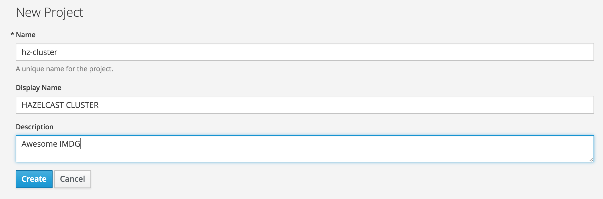
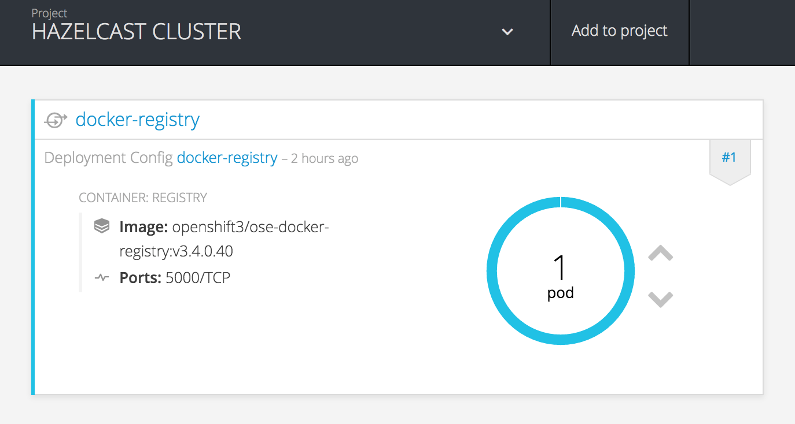
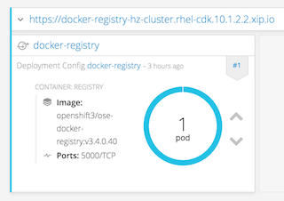
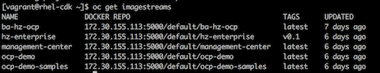
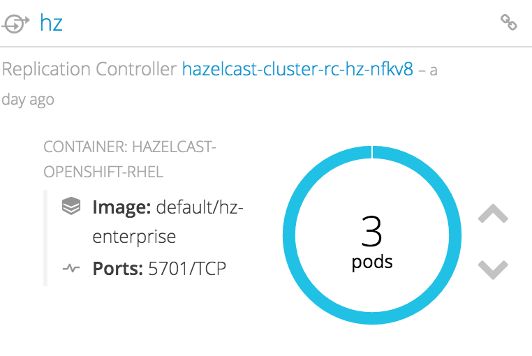

% HAZELCAST(1) RHEL7 Container Image Pages
% Hazelcast, Inc.
% March 16, 2017


# DESCRIPTION

This image simplifies the deployment of a Hazelcast Enterprise based standalone infrastructure. As a certified
Red Hat Enterprise Linux based image. It is built on top of RHEL 7.

This package consists of the following parts:

* Hazelcast Enterprise and regarding dependencies
* Red Hat Enterprise Linux (RHEL) 7.3
* Oracle Java 8
* Health and liveness scripts
* Start and stop scripts

# USAGE

## Build and Deployment to Private Docker Registry

### Prerequisites

1) Up and Running Openshift Container Platform (OCP) version 3.4 or 3.5 that you can login as ```system:admin```.

* You may install Openshift Container Development Kit from [Redhat](https://developers.redhat.com/products/cdk/download/), if you need to test on your local machine. Please note that
downloading and installation will require Redhat subscription. Moreover, please follow CDK installation
[document](https://access.redhat.com/documentation/en-us/red_hat_container_development_kit/2.4/html/installation_guide/).
After installation of CDK, you will need to have up and running Openshift Container Platform virtual machine.

2) RHEL 7.3 host with Docker 1.12 installation to build Hazelcast image. Please follow [this solution](https://access.redhat.com/solutions/253273) to register and subscribe.

* `NOTE:` You may use host machines that comes with OCP installations.

3) Another important note would be that this document assumes familiarity with `oc` CLI, OCP  and Docker knowledge.

### Building Hazelcast Enterprise Image

Hazelcast `Dockerfile` is buildable only RHEL 7.2/7.3 hosts with proper subscription.

Run below ```docker``` command under ```hazelcast-openshift-rhel``` directory to build image on RHEL host.

```
docker build . -t <your-image-name>:<version>
```

To verify image in Docker please run below command in shell:
```
docker images
```
You should see `<your-image-name>` as a repository.

### Pushing Image to Private Docker Registry in OCP

In order to push ```hazelcast``` image to docker registry in OCP installation, you may use ```default``` project in OCP, which has already configured docker registry and router.

If you choose to start from scratch please install below components under your project:
* Docker Registry with [this installation guide](https://docs.openshift.com/container-platform/3.4/install_config/registry/deploy_registry_existing_clusters.html)
* Router for accessing Docker registry from URL with [this installation guide](https://docs.openshift.com/container-platform/3.3/install_config/router/default_haproxy_router.html)

And [create a route](https://docs.openshift.com/container-platform/3.3/dev_guide/routes.html) for private Docker registry. This route will be referred as `<route-to-registry>` from now on.

Please also note that you need to login local docker registry before hand.
 ```
 docker login -a <your-ocp-user> -p <your-token> <route-to-registry>
 ```

You may get `<your-ocp-user>` from `oc whoami` CLI command on OCP VM, after connecting it via `vagrant ssh` or `oc login https://<route-to-ocp>:8443`. Moreover, you can get regarding `<your-token>` from `oc whoami -t` command.

Please beware that, in order to login registry, and execute push command `<your-ocp-user>` should have proper rights.

 During ```login``` you will probably get SSL handshake error, if you do please add your route to docker insecure registry list or read OCP documentation regarding [exposing private registry](https://docs.openshift.com/container-platform/3.5/install_config/registry/securing_and_exposing_registry.html).

After successful login, you may continue with ```taging``` your image with below sample command.
 ```
 docker tag <your-image-name>:<version> <route-to-registry>\<your-namespace>\<your-image-name>:<version>
  ```
Now, you can push your image to private registry with below command.

```
docker push <route-to-registry>\<your-namespace>\<your-image-name>:<version>
```

To verify image on OCP, you may execute below command in OCP shell.
```
oc get imagestreams
```

## Starting Hazelcast Enterprise Cluster

* Before starting to deploy Hazelcast Enterprise cluster make sure that you have a valid License key for Hazelcast Enterprise version.
  * You may get a trial key from [this link](https://hazelcast.com/hazelcast-enterprise-download/trial/)

### Creating Volume and Loading Custom Configurations
`This is a prerequisite` step for the next section if you have custom configurations or jars.

Moreover, OCP 3.5 installations on cloud providers like AWS, may not contain `Persistent Volumes`(PV) in that case, to deploy Hazelcast cluster with `hazelcast-template.js` it is a `prerequisite` to create a PV.

In order to share `custom configurations` or `custom domain jars` (for example EntryProcessor implementations) between Hazelcast Pods, you need to add a `persistent volume` in OCP. In `hazelcast-template.js` this directory is named as `/data/hazelcast`, and it should be claimed. Below, you can find how to add persistent volume in OCP. Please notice that it is just an example of persistent volume creation with `NFS`, there are many different ways that you can map volumes in Kubernetes and Openshift Platform. You can find available volumes via [this link](https://docs.openshift.com/container-platform/3.4/rest_api/kubernetes_v1.html#v1-volume)

* Login to your OCP console `oc login <your-ocp-url>` with `system:admin` user or rights
* Create a directory in master for the physical storage.
```
mkdir -p <your-pv-path>
chmod -R 777 <parent-path-to-pv> [may require root permissions]
# Add to /etc/exports
<your-pv-path> *(rw,root_squash)
# Enable the new exports without bouncing the NFS service
exportfs -a
```
`NFS` Security provisioning may be required, therefore you may need to add `nfsnobody` user and group to `<parent-path-to-pv>` for details please refer to [this link](https://docs.openshift.com/container-platform/3.4/install_config/persistent_storage/persistent_storage_nfs.html#install-config-persistent-storage-persistent-storage-nfs)

* Open an text editor and write below deployment YAML for persistent volume
```
apiVersion: v1
kind: PersistentVolume
metadata:
  name: <your-pv-name>
spec:
  capacity:
    storage: 2Gi
  accessModes:
    - ReadWriteOnce
    - ReadWriteMany
  persistentVolumeReclaimPolicy: Retain
  nfs:
    server: localhost
    path: <your-pv-path>
```

and save the file. Please also notice that `Reclaim Policy` is set as `Retain`. Therefore, Contents of this folder will remain as is, between successive `claims`.

`your-pv-name` is important and you need to input this name to `HAZELCAST_VOLUME_NAME` during deployments with `hazelcast-template.js`.

* Run `oc create -f <your-pv-yaml>` which will create a `PersistentVolume`
* Run `oc get pv` to verify and you should see `STATUS` as `AVAILABLE`
* Traverse to `<your-pv-path>` and copy your custom Hazelcast configuration as `hazelcast.xml`. You may also copy or transfer `custom jars` to this directory.
  * `IMPORTANT:` custom configuration file name must be `hazelcast.xml`
  * `HINT:` you may use `scp` or `stfp` to transfer these files.

If you need to redeploy Hazelcast cluster with `hazelcast-template.js`, you may need to remove logical persistent volume bindings before. Since their creation policy is `RETAIN`. In order to delete or tear down, please run below commands.
* `oc delete pvc hz-vc` [hz-vc is the claim name from Kubernetes template, you do not need to change its name]
* `oc delete pv <your-pv-name>`
* `oc create -f <your-pv-yaml>`

Please note that contents of your previous deployment is preserved. If you change claim policy to `RECYCLE`, you have to transfer all custom files to `<your-pv-path>` before each successive deployments.

### Deploying on Web Console

* In web browser, navigate to your OCP console page and login.
  * Your login user should have required access right to start docker registry and push images as described in `Build and Deployment to Private Docker Registry` section of this document.

* Create a project with `your-project-name`.

  

* Turn back to OCP shell and switch to your new project with `oc project <your-project-name>` command

* Add private Docker registry to your project
  * Please refer to [this link](https://docs.openshift.com/enterprise/3.2/install_config/install/docker_registry.html) for details.
  * Or you may create a infrastructure project to deploy your project `imagestreams`.

  

* Add route for newly created docker registry, please assign `passthrough` for TLS setting

  

* Push your Hazelcast Enterprise image to this registry, as described in section `Pushing Image to Private Docker Registry in OCP`.

* To verify pushed image in OCP, you may run below command
```
oc get imagestreams
```
You should see `<your-image-name>` under `NAME` column as below. In my case, it is named as `hz-enterprise`.



Another important point would be the `DOCKER REPO` entry for image, in succeeding part we will use this path in `kubernetes-template.js` to pull base image for our Hazelcast cluster.

* Click `Add to Project` and then `Import YAML/JSON` to start deploying Hazelcast cluster on OCP.

* Copy and Paste the contents of `kubernetes-template.js` on to editor, or browse and upload it.
  * This template file contains all the deployment information to setup a Hazelcast cluster from inside Openshift.
  It configures the necessary ReplicationController, health checks and image to use. It also offers a set of properties to be requested when creating a new cluster (such as clustername).

* Fill out Configuration properties section
  * `NAMESPACE` value is important and should match with your project namespace
* Change `"image": "hazelcast/hazelcast-openshift-rhel"` to `"image":"<registry-route>/<your-namespace>/<your-image-name>"`
* Enter your enterprise license key to `ENTERPRISE_LICENSE_KEY` input section.
* Enter `<your-pv-name>` to `HAZELCAST_VOLUME_NAME` input section.
  * `If you do not need any custom xml or jar` you can give a `PersistentVolume` name which may already created in OCP. You can get them via `oc get pv` command. Please note that these volumes have `RECYCLE` claim ploicy, also installations on cloud providers may not have these volumes.

* ...and it is ready to go.

    


# LABELS

Following labels are set for this image:

`name=`

The registry location and name of the image.

`version=`

The Red Hat Enterprise Linux version from which the container was built.

`release=`

The Hazelcast release version built into this image.


# SECURITY IMPLICATIONS

This image exposes port 5701 as the external port for cluster communication (member to member)
and between Hazelcast clients and the Hazelcast cluster (client-server).

The port is reachable from inside the Openshift environment only and is not registered for public
reachability.


# HISTORY

Initial version


# AUTHORS

Hazelcast, Inc.
