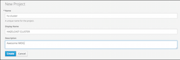
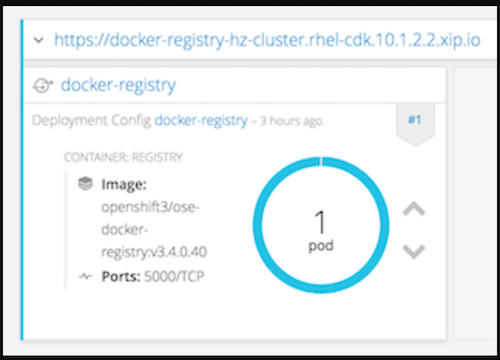
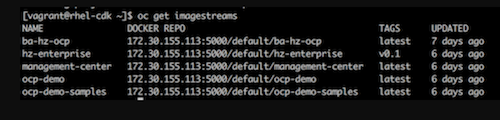

## Building and Deploying to Private Docker Registry

### Prerequisites

1) Up and Running OpenShift Container Platform (OCP) version 3.4 or 3.5 that you can login as `system:admin`.

  * You may install OpenShift Container Development Kit from [Redhat](https://developers.redhat.com/products/cdk/download/), if you need to test on your local machine. Please note that
downloading and installing will require Redhat subscription. Moreover, please follow the CDK installation
[document](https://access.redhat.com/documentation/en-us/red_hat_container_development_kit/2.4/html/installation_guide/).
After installation of the CDK, you will need to have an up and running OpenShift Container Platform virtual machine.

<br>
2) RHEL 7.3 host with Docker 1.12 installation to build Hazelcast image. Please follow [this solution](https://access.redhat.com/solutions/253273) to register and subscribe.

 ***NOTE***: *You may use host machines that comes with OCP  installations.*

<br>
3) Another important note would be that this document assumes familiarity with `oc` CLI, OCP and Docker.


### Building Hazelcast Enterprise Image

Hazelcast `Dockerfile` can be built only on RHEL 7.2/7.3 hosts with proper subscription.

Run the following Docker command under `hazelcast-openshift-rhel` directory to build the image on RHEL host:

```
docker build . -t <your-image-name>:<version>
```

To verify the image in Docker, please run the following command in shell:

```
docker images
```

You should see `<your-image-name>` as a repository.


### Pushing Image to Private Docker Registry in OCP

In order to push `hazelcast` image to Docker registry in OCP installation, you can use `default` project in OCP, which has already configured Docker registry and router.

If you choose to start from scratch please install the following components under your project:

* Docker Registry with [this installation guide](https://docs.openshift.com/container-platform/3.4/install_config/registry/deploy_registry_existing_clusters.html).
* Router for accessing Docker registry from URL with [this installation guide](https://docs.openshift.com/container-platform/3.3/install_config/router/default_haproxy_router.html).

And [create a route](https://docs.openshift.com/container-platform/3.3/dev_guide/routes.html) for private Docker registry. This route will be referred as `<route-to-registry>` from now on.

Please also note that you need to login to local Docker registry beforehand with the following command:

```
docker login -a <your-ocp-user> -p <your-token> <route-to-registry>
```

You may get `<your-ocp-user>` from `oc whoami` CLI command on OCP VM after connecting it via `vagrant ssh` or `oc login https://<route-to-ocp>:8443`. Moreover, you can get regarding `<your-token>` from `oc whoami -t` command.

Please be aware that, in order to login to registry and execute push command, `<your-ocp-user>` should have the proper rights.

During `login`, you will probably get SSL handshake error. If you do please add your route to Docker insecure registry list or read the OCP documentation regarding [exposing private registry](https://docs.openshift.com/container-platform/3.5/install_config/registry/securing_and_exposing_registry.html).

After the successful login, you may continue with tagging your image with the following sample command:

 ```
docker tag <your-image-name>:<version> <route-to-registry>\<your-namespace>\<your-image-name>:<version>
```

Now, you can push your image to the private registry using the following command:

```
docker push <route-to-registry>\<your-namespace>\<your-image-name>:<version>
```

To verify the image on OCP, you can execute the following command in OCP shell:

```
oc get imagestreams
```

## Starting Hazelcast Enterprise Cluster

Before starting to deploy your Hazelcast Enterprise cluster, make sure that you have a valid license key for Hazelcast Enterprise version. You can get a trial key from [this link](https://hazelcast.com/hazelcast-enterprise-download/trial/).

### Creating Volume and Loading Custom Configurations

This is a **prerequisite** step for the next section if you have custom configurations or JARs.

Moreover, OCP 3.5 installations on cloud providers like AWS may not contain `Persistent Volumes`(PV). In that case, you first must create a PV to deploy Hazelcast cluster with `hazelcast-template.js` .

In order to share custom configurations or custom domain JARs (for example `EntryProcessor` implementations) between Hazelcast Pods, you need to add a persistent volume in OCP. In `hazelcast-template.js` this directory is named as `/data/hazelcast`, and it should be claimed. Below, you can find how to add a persistent volume in OCP. Please notice that it is just an example of a persistent volume creation with `NFS`; there are many different ways that you can map volumes in Kubernetes and OpenShift Platform. You can find the available volumes via [this link](https://docs.openshift.com/container-platform/3.4/rest_api/kubernetes_v1.html#v1-volume)

* Login to your OCP console using the command `oc login <your-ocp-url>` with `system:admin` user or rights.
* Create a directory in master for the physical storage as shown below:
 
```
mkdir -p <your-pv-path>
chmod -R 777 <parent-path-to-pv> [may require root permissions]
# Add to /etc/exports
<your-pv-path> *(rw,root_squash)
# Enable the new exports without bouncing the NFS service
exportfs -a
```

`NFS` Security provisioning may be required, therefore you may need to add `nfsnobody` user and group to `<parent-path-to-pv>`. Please refer to [this link](https://docs.openshift.com/container-platform/3.4/install_config/persistent_storage/persistent_storage_nfs.html#install-config-persistent-storage-persistent-storage-nfs) for details.

* Open a text editor and add the following deployment YAML for persistent volume:
 
```
apiVersion: v1
kind: PersistentVolume
metadata:
  name: <your-pv-name>
spec:
  capacity:
    storage: 2Gi
  accessModes:
    - ReadWriteOnce
    - ReadWriteMany
  persistentVolumeReclaimPolicy: Retain
  nfs:
    server: localhost
    path: <your-pv-path>
```

Save this file. Please also notice that `Reclaim Policy` is set as `Retain`. Therefore, contents of this folder will remain as is, between successive `claims`.

`your-pv-name` is important and you need to input this name to `HAZELCAST_VOLUME_NAME` during deployments with `hazelcast-template.js`.

* Run `oc create -f <your-pv-yaml>` which will create a `PersistentVolume`.
* Run `oc get pv` to verify, and you should see `STATUS` as `AVAILABLE`.
* Go to `<your-pv-path>` and copy your custom Hazelcast configuration as `hazelcast.xml`. You may also copy or transfer `custom jars` to this directory. Make sure that your custom configuration file is named as  `hazelcast.xml`. You may use `scp` or `sftp` to transfer these files.

If you need to redeploy Hazelcast cluster with `hazelcast-template.js`, first you may need to remove the logical persistent volume bindings, since their creation policy is `RETAIN`. In order to delete or tear down, please run the following commands:

* `oc delete pvc hz-vc` (hz-vc is the claim name from Kubernetes template, you do not need to change its name)
* `oc delete pv <your-pv-name>`
* `oc create -f <your-pv-yaml>`

Please note that contents of your previous deployment is preserved. If you change the claim policy to `RECYCLE`, you have to transfer all custom files to `<your-pv-path>` before each successive deployments.

### Deploying on Web Console

* In the web browser, navigate to your OCP console page and login.
* Your login user should have required access right to start Docker registry and push images as described in [Building and Deploying to Private Docker Registry section](#building-and-deploying-to-private-docker-registry) of this document.

* Create a project with `your-project-name`:

  

* Turn back to OCP shell and switch to your new project with the command `oc project <your-project-name>`.

* Add the private Docker registry to your project

* Please refer to [this link](https://docs.openshift.com/enterprise/3.2/install_config/install/docker_registry.html) for details.

* Or you may create an infrastructure project to deploy your project `imagestreams`.

  

* Add route for the newly created Docker registry. Please assign `passthrough` for TLS setting:

  
 
* Push your Hazelcast Enterprise image to this registry, as described in section [Pushing Image to Private Docker Registry in OCP](#pushing-image-to-private-docker-registry-in-ocp).

* To verify the pushed image in OCP, you can run the following command:
 
```
oc get imagestreams
```

You should see `<your-image-name>` under `NAME` column as below. For the below example, it is named as `hz-enterprise`.



Another important point is the `DOCKER REPO` entry for image. In the following steps we will use this path in `kubernetes-template.js` to pull the base image for our Hazelcast cluster.

* Click `Add to Project` and then `Import YAML/JSON` to start deploying Hazelcast cluster on OCP.

* Copy and paste the contents of `kubernetes-template.js` onto the editor, or browse and upload it.

* This template file contains all the deployment information to setup a Hazelcast cluster inside OpenShift. It configures the necessary `ReplicationController`, health checks and image to use. It also offers a set of properties to be requested when creating a new cluster (such as `clustername`).

* Fill out the `Configuration Properties` section.

* `NAMESPACE` value is important and should match with your project namespace.

* Change `"image": "hazelcast/hazelcast-openshift-rhel"` to `"image":"<registry-route>/<your-namespace>/<your-image-name>"`

* Enter your Hazelcast Enterprise license key to `ENTERPRISE_LICENSE_KEY` input section.

* Enter `<your-pv-name>` to `HAZELCAST_VOLUME_NAME` input section.

* If you do not need any custom XML or JAR, you can give a `PersistentVolume` name which may already created in OCP. You can get them via `oc get pv` command. Please note that these volumes have `RECYCLE` claim policy. Also, installations on the cloud providers may not have these volumes.

* Now it is ready to go.

    


